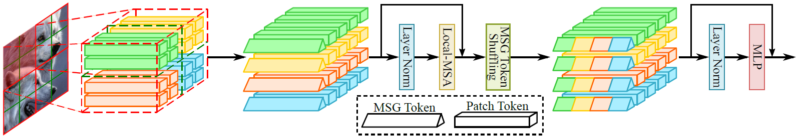
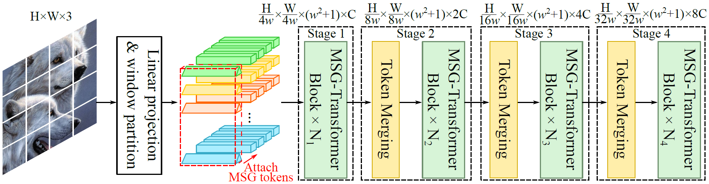

# MSG-Transformer

Official implementation of the paper [MSG-Transformer: Exchanging Local Spatial Information by Manipulating Messenger Tokens](https://arxiv.org/abs/2105.15168),  
by [Jiemin Fang](https://jaminfong.cn/), [Lingxi Xie](http://lingxixie.com/), [Xinggang Wang](https://xinggangw.info/), [Xiaopeng Zhang](https://sites.google.com/site/zxphistory/), [Wenyu Liu](http://eic.hust.edu.cn/professor/liuwenyu/), [Qi Tian](https://scholar.google.com/citations?hl=en&user=61b6eYkAAAAJ).

We propose a novel Transformer architecture, named MSG-Transformer, which enables efficient and flexible information exchange by introducing MSG tokens to sever as the information hub.

-----------------------------

Transformers have offered a new methodology of designing neural networks for visual recognition. Compared to convolutional networks, Transformers enjoy the ability of referring to global features at each stage, yet the attention module brings higher computational overhead that obstructs the application of Transformers to process high-resolution visual data. This paper aims to alleviate the conflict between efficiency and flexibility, for which we propose a specialized token for each region that serves as a messenger (MSG). Hence, by manipulating these MSG tokens, one can flexibly exchange visual information across regions and the computational complexity is reduced. We then integrate the MSG token into a multi-scale architecture named MSG-Transformer. In standard image classification and object detection, MSG-Transformer achieves competitive performance and the inference on both GPU and CPU is accelerated.



## Updates
* 2021.12.1 The architecture is updated with stronger performance on both ImageNet and MS-COCO.
* 2021.6.2 Code for ImageNet classification is released. Pre-trained models will be available soon. 

## Requirements
* PyTorch==1.7
* timm==0.3.2
* Apex
* opencv-python>=3.4.1.15
* yacs==0.1.8

## Data Preparation
Please organize your ImageNet dataset as follows.
```
path/to/ImageNet
|-train
| |-cls1
| | |-img1
| | |-...
| |-cls2
| | |-img2
| | |-...
| |-...
|-val
  |-cls1
  | |-img1
  | |-...
  |-cls2
  | |-img2
  | |-...
  |-...
```

## Training
Train MSG-Transformers on ImageNet-1k with the following script.  
For `MSG-Transformer-T`, run
```
python -m torch.distributed.launch --nproc_per_node 8 main.py \
    --cfg configs/msg_tiny_p4_win7_224.yaml --data-path <dataset-path> --batch-size 128
```
For `MSG-Transformer-S`, run
```
python -m torch.distributed.launch --nproc_per_node 8 main.py \
    --cfg configs/msg_small_p4_win7_224.yaml --data-path <dataset-path> --batch-size 128
```
For `MSG-Transformer-B`, we recommend running the following script on two nodes, where each node is with 8 GPUs.
```
python -m torch.distributed.launch --nproc_per_node 8 \
    --nnodes=2 --node_rank=<node-rank> --master_addr=<ip-address> --master_port=<port> \
    main.py --cfg configs/msg_base_p4_win7_224.yaml --data-path <dataset-path> --batch-size 64
```

## Evaluation
Run the following script to evaluate the pre-trained model.
```
python -m torch.distributed.launch --nproc_per_node <GPU-number> main.py \
    --cfg <model-config> --data-path <dataset-path> --batch-size <batch-size> \
    --resume <checkpoint> --eval
```

## Main Results
### ImageNet-1K
| **Model** | **Input size** | **Params** | **FLOPs** | **GPU images/s** | **CPU latency** | Top-1 acc (%) |
|:-:|:-:|:-:|:-:|:-:|:-:|:-:|
| MSG-Trans-T | 224 | 25M  | 3.8G | 726.5 | 157ms  | 82.4 |
| MSG-Trans-S | 224 | 56M  | 8.4G | 422.5 | 272ms  | 83.4 |
| MSG-Trans-B | 224 | 84M  | 14.2G  | 267.6 | 424ms  | 84.0 |
### MS-COCO
| **Method** | **mAP<sup>*box*** | **mAP<sup>*mask*** | **Params** | **FLOPs** | **FPS** |
|:-:|:-:|:-:|:-:|:-:|:-:|
| MSG-Trans-T  | 51.4        | 44.6         | 83M        | 731G      | 9.1     |
| MSG-Trans-S  | 52.5        | 45.5         | 113M       | 831G      | 7.5     |
| MSG-Trans-B  | 52.8        | 45.7         | 142M       | 956G      | 6.1     |

## Acknowledgements
This repository is based on [Swin-Transformer](https://github.com/microsoft/Swin-Transformer) and [timm](https://github.com/rwightman/pytorch-image-models/). Thanks for their contributions to the community.

## Citation
If you find this repository/work helpful in your research, welcome to cite the paper.
```
@inproceedings{fang2021msg,
  title={Msg-transformer: Exchanging local spatial information by manipulating messenger tokens},
  author={Fang, Jiemin and Xie, Lingxi and Wang, Xinggang and Zhang, Xiaopeng and Liu, Wenyu and Tian, Qi},
  booktitle={CVPR},
  year={2022}
}
```
