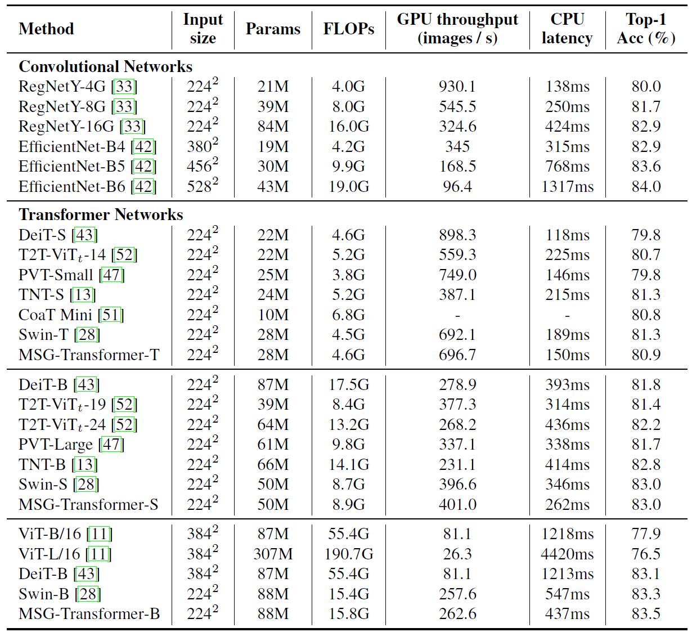
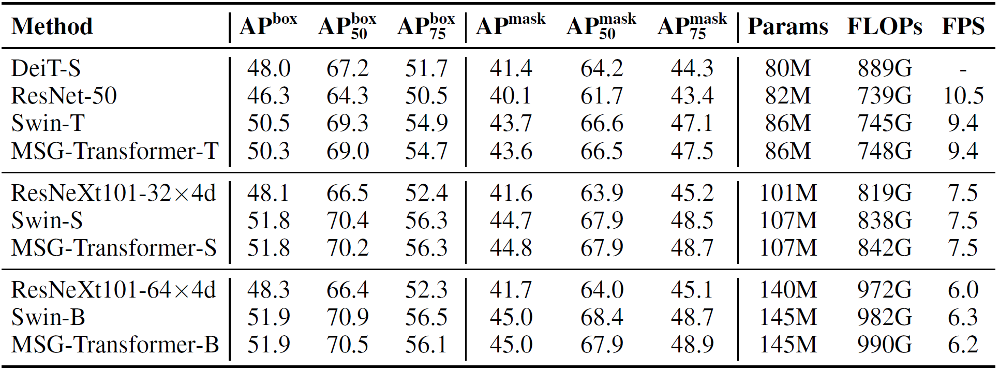

# MSG-Transformer

The code of the paper [MSG-Transformer: Exchanging Local Spatial Information by Manipulating Messenger Tokens](https://arxiv.org/abs/2105.15168),  
by [Jiemin Fang](https://jaminfong.cn/), [Lingxi Xie](http://lingxixie.com/), [Xinggang Wang](https://xinggangw.info/), [Xiaopeng Zhang](https://sites.google.com/site/zxphistory/), [Wenyu Liu](http://eic.hust.edu.cn/professor/liuwenyu/), [Qi Tian](https://scholar.google.com/citations?hl=en&user=61b6eYkAAAAJ).

We propose a novel Transformer architecture, named MSG-Transformer, which enables efficient and flexible information exchange by introducing MSG tokens to sever as the information hub.

-----------------------------

Transformers have offered a new methodology of designing neural networks for visual recognition. Compared to convolutional networks, Transformers enjoy the ability of referring to global features at each stage, yet the attention module brings higher computational overhead that obstructs the application of Transformers to process high-resolution visual data. This paper aims to alleviate the conflict between efficiency and flexibility, for which we propose a specialized token for each region that serves as a messenger (MSG). Hence, by manipulating these MSG tokens, one can flexibly exchange visual information across regions and the computational complexity is reduced. We then integrate the MSG token into a multi-scale architecture named MSG-Transformer. In standard image classification and object detection, MSG-Transformer achieves competitive performance and the inference on both GPU and CPU is accelerated.


## Noting
* Code is coming soon.

## Main Results
### ImageNet-1K

### MS-COCO


## Citation
If you find this repository/work helpful in your research, welcome to cite the paper.
```
@article{fang2021msgtransformer,
  title={MSG-Transformer: Exchanging Local Spatial Information by Manipulating Messenger Tokens},
  author={Jiemin Fang and Lingxi Xie and Xinggang Wang and Xiaopeng Zhang and Wenyu Liu and Qi Tian},
  journal={arXiv:2105.15168},
  year={2021}
}
```
